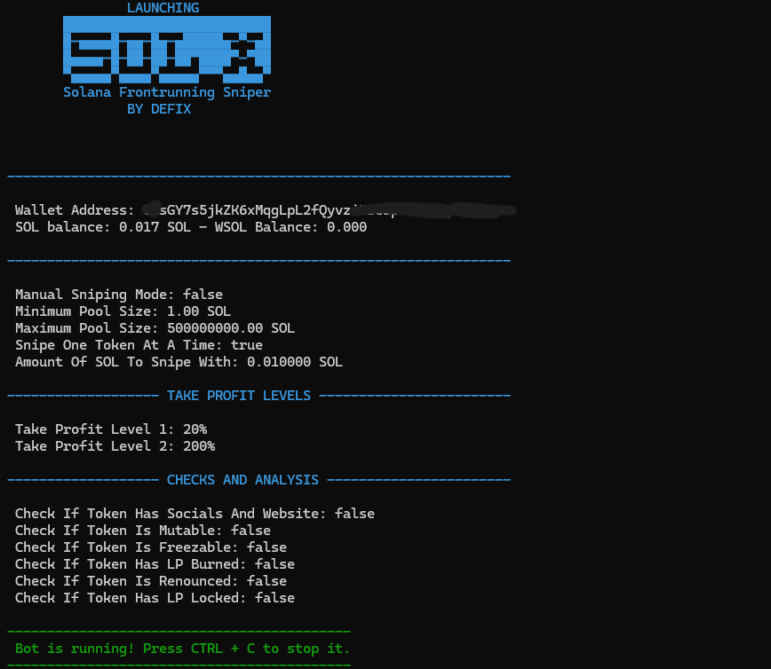

<div align="center">
  
  <h1>SOLX</h1>
  <h2>Solana V6 Auto/Manual Sniper</h2>
  <p>Free V6 sniper trial from DeFiX Labs</p>
  
  
<p align="center">
  
  
</p>

  
  
  [](https://opencollective.com/fakerjs#section-contributors)
  [](https://opencollective.com/fakerjs)
  
</div>



## 🚀 Features

- 💌 Auto approve AND Auto Snipe (Limited in Free)
- ⏰ Buys and Sells instantly using sandwich strategy vector
- 🌏 Sell tokens with your custom increase in price, like 50%, 100%, 200%.
- 💸 Contains Stop loss, trailing stop loss, 2 take profit levels and 7 filters
- 💸 Open source (Literally don't have to pay me anything to run this bot), but if you like it buy the premium version on defix.shop
- Enjoy and leave a star, if you like it!

> **Note**: Please install a code visual tool first such as Visual Studio Code as it will help you set up this bot within 5 minutes

## 📦 Install

OPTION 1, select your OS and download an executable GUI:
  
  [](https://defix.shop/portfolio/base-sniping-bot-newest/)
  
OPTION 2 for Linux, Windows and Mac users that want to run the opensourced code:
  
1. Download python3.7.2+ for your PC from python org

2. Open terminal in the bot folder and type 

```
pip3 install -r requirements.txt
```
 this will install all modules required to run the bot
 
3. In the same terminal type 

```
python3 ethereum.py
```
The GUI will pop up
```

## 📝 Changelog

Detailed changes for each release:

#### • Version v1 [New Interface] - 1 week ago

## 🔑 License

[MIT]
